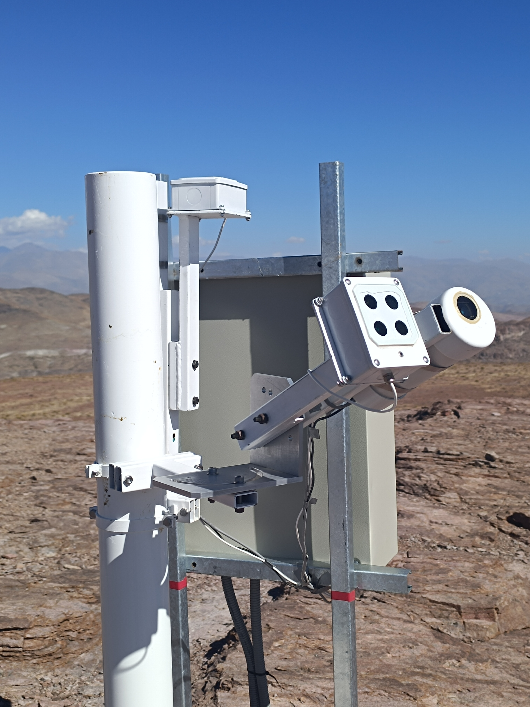

.. Dark Sky Protection Project Reader documentation master file, created by
   sphinx-quickstart on Thu Nov 20 14:55:08 2025.
   You can adapt this file completely to your liking, but it should at least
   contain the root `toctree` directive.

DSPP Reader documentation
=========================

The `Dark Skies Protection Project' Reader` is a python package for reading
`SMQ-LE <https://unihedron.com/projects/sqm-le/>`_ and
`TESS-W4C <https://tessskysensor.blogspot.com/2021/10/tess-w4c.html>`_ devices. It creates a TCP/IP connection to the
device and polls the device for new data.

    SQM-LE and TESS-W4C installed in Cerro Morado, Chile.

.. toctree::
   :maxdepth: 2
   :caption: Contents:

   install
   usage
   data_format
   deployment

API Reference
=============

.. toctree::
   :maxdepth: 2

   api/modules

Indices and Tables
==================

* :ref:`genindex`
* :ref:`modindex`
* :ref:`search`
